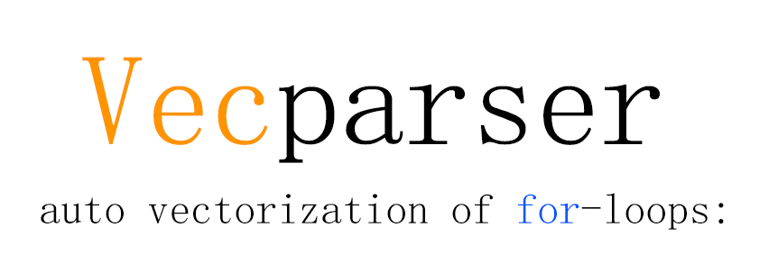
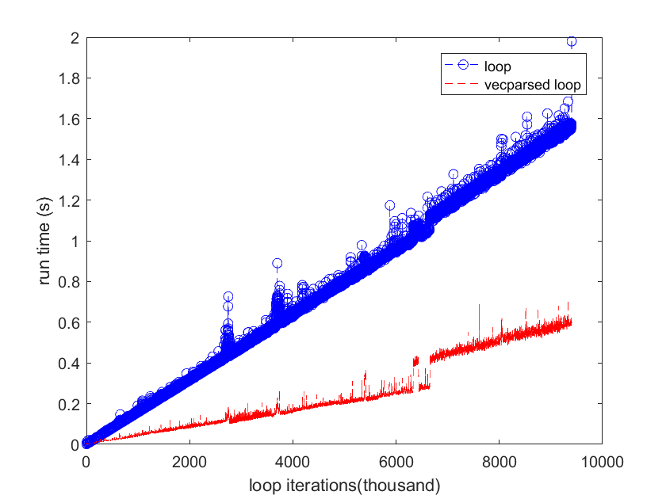

<p align="center">
    
</p>
<!-- # Vecparser -->

<div align="center">
    
[](LICENSE)


[English](README.md) | 简体中文

</div>

Vecparser 是一个自动将任意层 for 循环（在 MATLAB、CVX 中）尽可能向量化的解析器，由此节省大量（有时97%）的程序运行时间。这项技术基于我2022年发在https://ask.cvxr.com/t/how-to-vectorize-most-constraint-loops-in-cvx/9804 的原创帖子。
## Table of Contents

- [快速启动](#快速启动)
- [示例](#示例)
- [性能表现](#性能表现)
- [注意事项](#注意事项)
- [未来工作](#未来工作)
- [许可证](#许可证)
- [引用](#引用)
- [致谢](#致谢)
## 快速启动
先克隆仓库
```bash
git clone https://github.com/jackfsuia/Vecparser.git
```
然后运行下面命令安装依赖项，
```bash
pip install sly
```
要向量化你的 MATLAB 和 CVX 中的 for 循环，请先将循环写到 [loop_eiditor.m](loop_eiditor.m)，在此之前建议读一下[注意事项](#注意事项))。 然后运行
```bash
python vecparser.py
```
大功告成! 向量化后的表达式也会打印在 [loop_eiditor.m](loop_eiditor.m) , 所以请刷新一下这个文件。

## 示例
比如下面的原始循环，先把它抄到[loop_eiditor.m](loop_eiditor.m)如下:
```matlab
% loop_eiditor.m
for n1=1:N1
    for n2=1:N2
        for n3=1:N3
            for n4=1:N4
                if n1~=n2*n3 && n3>n4^3
                    x(n1,n2,n3,n4)= (y(n1,n3)+z(n4))*h(n2,n3,n1); % 注意: size(z) 必须是 "N4 1", 而不是 "1 N4"。
                    q(n4,n3,n2,n1)= -h(n2,n3,n1)+((y(n1,n3)+z(n4))*h(n2,n3,n1))^2;
                end
            end
        end
    end
end
```
然后运行下面命令 
```bash
python vecparser.py
```
结果就会附加到 [loop_eiditor.m](loop_eiditor.m) 后面，如下
```matlab
% loop_eiditor.m
for n1=1:N1
    for n2=1:N2
        for n3=1:N3
            for n4=1:N4
                if n1~=n2*n3 && n3>n4^3
                    x(n1,n2,n3,n4)= (y(n1,n3)+z(n4))*h(n2,n3,n1); % 注意: size(z) 必须是 "N4 1", 而不是 "1 N4"。
                    q(n4,n3,n2,n1)= -h(n2,n3,n1)+((y(n1,n3)+z(n4))*h(n2,n3,n1))^2;
                end
            end
        end
    end
end

%-------------------------vectorized by Vecparser as-----------------------

cached_condition_for_this=(permute(repmat(repmat((1:N1)',1,N2,N3)~=permute(repmat(repmat((1:N2)',1,N3).*permute(repmat((1:N3)',1,N2),[2,1]),1,1,N1),[3,1,2]),1,1,1,N4),[2,3,1,4])&permute(repmat(permute(repmat((1:N3)',1,N4),[2,1])>repmat((1:N4)'.^3,1,N3),1,1,N2,N1),[3,2,4,1]));

x=permute(permute((cached_condition_for_this),[4,1,2,3]).*permute((permute(repmat((permute(repmat(y,1,1,N4),[1,3,2])+permute(repmat(z,1,N1,N3),[2,1,3])),1,1,1,N2),[4,3,1,2]).*repmat(h,1,1,1,N4)),[4,1,2,3])+permute((1-permute((cached_condition_for_this),[3,4,1,2])),[2,3,4,1]).*permute(x,[4,2,3,1]),[4,2,3,1]);

q=permute(permute((cached_condition_for_this),[4,1,2,3]).*permute((repmat(-h,1,1,1,N4)+permute(permute((permute(repmat((permute(repmat(y,1,1,N4),[1,3,2])+permute(repmat(z,1,N1,N3),[2,1,3])),1,1,1,N2),[4,3,1,2]).*repmat(h,1,1,1,N4)),[3,4,1,2]).^2,[3,4,1,2])),[4,1,2,3])+permute((1-permute((cached_condition_for_this),[3,4,1,2])),[2,3,4,1]).*permute(q,[1,3,2,4]),[1,3,2,4]);

%-----Please clear this file each time before you write a new loop on------
```
现在将结果复制到你的 matlab 中去替换原始的循环，试着运行一下。

 *觉得有用的话，请帮我们点颗星 :star: ，谢谢~~*
 ## 性能表现
我在老电脑上跑了仿真，电脑配置是: Intel(R) Xeon(R) CPU E5-2660 v2 @ 2.20GHz, RAM 16G. 结果如下:


另外，当迭代次数过大的时候，向量化for循环会因为内存不足而导致电脑死机吗，在这些情况下向量化跑的反而没有原始循环那么快。或许内存不足的时候得在向量化和for循环之间做权衡，或许当考虑用GPU来计算的时候整个情况又会更微妙。
## 注意事项
支持任意位置的多个嵌套if块和非if块， 支持所有Matlab向量化运算符，支持自定义的输出输入**维度不变**的向量化函数，支持CVX的凸不等式、等式：>=,<=,==。 这是个实验性的项目，现阶段可能有一些bug。
## 未来工作
- 支持降维式运算符，比如 `sum`, `norm`, `*`(矩阵乘)。
- 推广到其他语言 (e.g., python)。
  
## 许可证

Vecparser 根据位于此仓库根目录中的 [LICENSE](LICENSE) 文件中的 Apache 2.0 许可证授权。

## 引用

如果这项工作对你有所帮助，请引用为：

```bibtex
@article{Vecparser,
  title={Vecparser: a parser that vectorizes your nested for-loops (in MATLAB, CVX) as much as possible.}, 
  author={Yannan Luo},
  year={2024},
  url={https://github.com/jackfsuia/Vecparser}
}
```
## 致谢

这个仓库使用了[pymatlabparser](https://github.com/jol-jol/pymatlabparser) 中的 matlablexer。此仓库的[pymatlabparser](pymatlabparser)文件夹完全是从那里复制过来的，几乎没有修改。感谢他们出色的工作。
